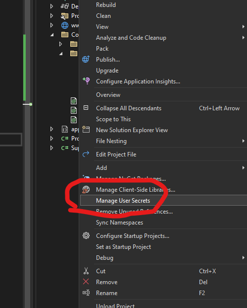

### Get a base app up and running

#### 1. Create or Open Your .NET 8.0 Web Application
Create a new Blazor app.

For the keyboard types:

```bash

dotnet new blazor --name CliApp1
```


#### 2. Create a simple POCO to play with

``` csharp
namespace GetStarted
{
    public class SuperSecretStuff
    {
        public string? SecretThing1 { get; set; }
        public int SecretThing2 { get; set;}
    }
}
```

or

```bash

dotnet new class --name SuperSecretStuff

```

#### 3. Configure the options and show them somewhere fun

Add the UserSecrests nuget package

```bash 

dotnet add package Microsoft.Extensions.Configuration
dotnet add package Microsoft.Extensions.Configuration.UserSecrets

```

In Program.cs

``` csharp

builder.Services.Configure<SuperSecretStuff>(builder.Configuration.GetSection("SuperSecretStuff"));

```

in Homer.razor:

```csharp

@page "/"
@using Microsoft.Extensions.Options
@inject IOptions<SuperSecretStuff> Options

<PageTitle>Home</PageTitle>

<h1>Hello, world!</h1>

<p>Welcome to your new app.</p>

<p>SuperSecretThing1 is @Options.Value.SecretThing1</p>

<p>SuperSecretThing2 is @Options.Value.SecretThing2</p>
```

#### 4. Make an entry in your appsettings.json

```json

  "SuperSecretStuff": {
    "SecretThing1":  "appsettings.json",
    "SecretThing2": 1
  }

  ```

#### 5. Make sure that the app works

### Add in the User-Secrets

#### 1. Initialize User-Secrets

**For the IDE**


The "secrets.json" file will be opened in the IDE.

**For the CLI**

Initialize user-secrets for your project:

```bash

dotnet user-secrets init

```

#### 3. Add Secrets to User-Secrets

**For the IDE**

```json

{
  "SuperSecretStuff": {
    "SecretThing1": "secrets.json",
    "SecretThing2": 2
  }
}

```

**For the CLI**

Add a secret to the user-secrets store:
```bash
dotnet user-secrets set "MySecret" "ThisIsASecretValue"
```

#### 4. Update `MyWebApp.csproj`
Ensure your project file includes the `UserSecretsId` property:
```xml
<Project Sdk="Microsoft.NET.Sdk.Web">
  <PropertyGroup>
    <TargetFramework>net8.0</TargetFramework>
    <UserSecretsId>aspnet-MyWebApp-12345678-1234-1234-1234-1234567890ab</UserSecretsId>
  </PropertyGroup>
</Project>
```

#### 5. Modify `Program.cs`

Update `Program.cs` to include user-secrets in the configuration:

```csharp

using BlazorApp1.Components;

namespace BlazorApp1
{
    public class Program
    {
        public static void Main(string[] args)
        {
            var builder = WebApplication.CreateBuilder(args);

            // Add services to the container.
            builder.Services.AddRazorComponents()
                .AddInteractiveServerComponents();

            builder.Services.Configure<SuperSecretStuff>(builder.Configuration.GetSection("SuperSecretStuff"));

            builder.Configuration.AddUserSecrets<Program>();

            var app = builder.Build();

            // Configure the HTTP request pipeline.
            if (!app.Environment.IsDevelopment())
            {
                app.UseExceptionHandler("/Error");
                // The default HSTS value is 30 days. You may want to change this for production scenarios, see https://aka.ms/aspnetcore-hsts.
                app.UseHsts();
            }

            app.UseHttpsRedirection();

            app.UseStaticFiles();
            app.UseAntiforgery();

            app.MapRazorComponents<App>()
                .AddInteractiveServerRenderMode();

            app.Run();
        }
    }
}
```

#### 6. Run Your Application
Run your application to see the secret in action:
```bash
dotnet run
```

#### 7. Access the Secrets Endpoint
Navigate to `https://localhost:5001/secrets` in your browser. You should see the secret value displayed:
```
Secret Value: ThisIsASecretValue
```

### Summary
This example demonstrates how to add user-secrets to an existing .NET 8.0 web application, configure the application to use these secrets, and create an endpoint to access and display the secret value.

Would you like more details on any specific part of this process?

Source: Conversation with Copilot, 7/14/2024
(1) Safe storage of app secrets in development in ASP.NET Core. https://learn.microsoft.com/en-us/aspnet/core/security/app-secrets?view=aspnetcore-8.0.
(2) How to add User Secrets in a .NET Core console app | makolyte. https://makolyte.com/how-to-add-user-secrets-in-a-dotnetcore-console-app/.
(3) Safe storage of app secrets during development. https://aspnetcore.readthedocs.io/en/stable/security/app-secrets.html.
(4) How to get "Manage User Secrets" in a .NET Core console-application?. https://stackoverflow.com/questions/42268265/how-to-get-manage-user-secrets-in-a-net-core-console-application.
(5) Create an ASP.NET Core web app with user data protected by authorization. https://learn.microsoft.com/en-us/aspnet/core/security/authorization/secure-data?view=aspnetcore-8.0.